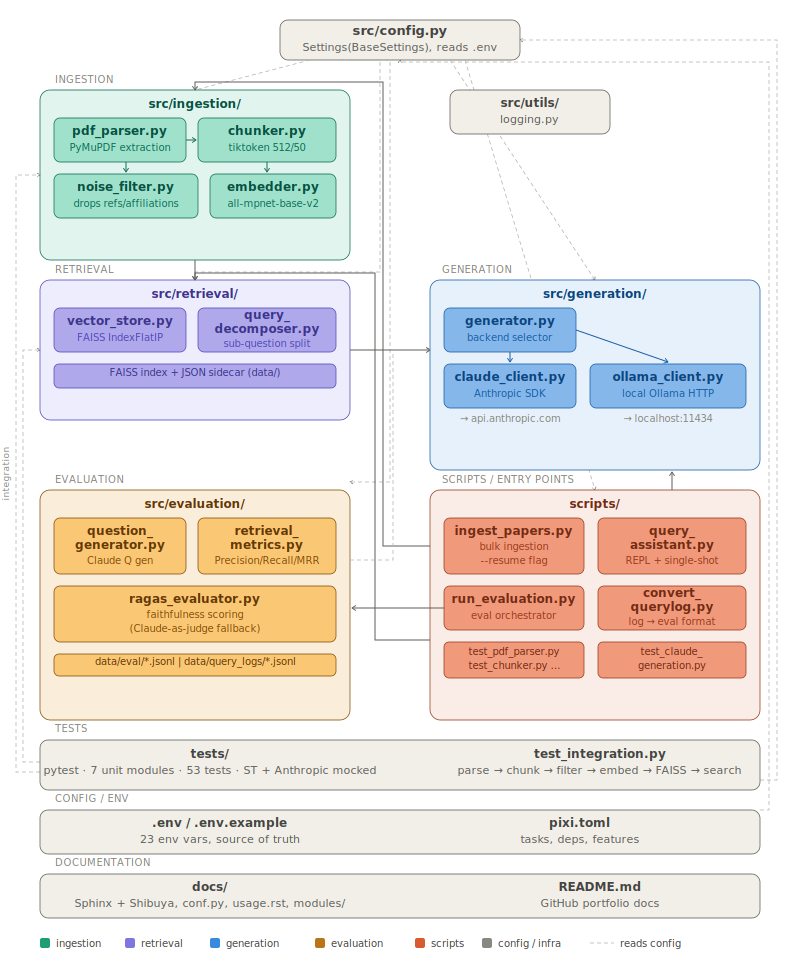

# Zotero RAG Assistant

A retrieval-augmented generation (RAG) system for querying a personal Zotero research library (~600 papers, mainly from psychology and neuroscience) using local embeddings and the Claude API. Built as a learning project to understand RAG architecture from the ground up — each component was implemented independently before any orchestration layer was introduced.

---

## What It Does

Ask a question in natural language → the system retrieves the most relevant passages from your PDF library → Claude answers using only that context, with numbered citations back to the source chunks.

```
$ pixi run query "What does the literature say about working memory and fluid intelligence?"

[streaming answer with chunk citations]
[claude-sonnet-4-6 · 412 tokens · $0.012345]
```

---

## Architecture



**Ingestion:** PDFs are parsed with PyMuPDF, split into 512-token sliding-window chunks (50-token overlap, tiktoken `cl100k_base`), filtered for noise (reference lists, affiliations, funding blocks — ~45% of chunks dropped), then embedded with `all-mpnet-base-v2` (768-dim, CPU-only batch inference).
**Retrieval:** embeddings are stored in a FAISS `IndexFlatIP` index with L2-normalised cosine similarity; an optional query decomposer splits complex queries into sub-questions via Claude before merging and deduplicating results.
**Generation:** a backend selector routes to either the Anthropic API (`claude_client.py`, cost tracked per query) or a local Ollama instance (`ollama_client.py`).

All layers are independently testable. The pipeline was built one component at a time, with each stage confirmed working before moving to the next.

---

## Key Design Decisions

**Token-based chunking over character-based** — tiktoken gives token-accurate splits that respect LLM context limits. Chunk size (512) and overlap (50) are environment-configurable, not hardcoded.

**Noise filtering as a separate module** — reference lists, author affiliations, and funding acknowledgments degrade retrieval quality without contributing semantic signal. Filtering post-chunking but pre-embedding keeps the parser and chunker concerns clean. Confirmed ~45% chunk drop rate on a test paper, with all drops verified as legitimate noise.

**`all-mpnet-base-v2` over MiniLM variants** — higher quality embeddings at the cost of slightly slower inference; acceptable tradeoff for a CPU-only setup querying a static library.

**FAISS `IndexFlatIP` over IVF clustering** — exact cosine similarity is fast enough at ~30K vectors (600 papers × ~50 chunks). IVF approximate search would add complexity with no meaningful latency benefit at this scale.

**Local embeddings only** — zero embedding cost. The only API spend is at query time (Claude generation), which is tracked per-query and per-session.

**`all-mpnet-base-v2` already produces unit-norm vectors** — `faiss.normalize_L2()` is called at both write and query time anyway as a safety net, since cosine similarity via inner product requires unit vectors.

---

## What's Built

| Component | File | Status |
|---|---|---|
| PDF parser | `src/ingestion/pdf_parser.py` | ✅ complete |
| Text chunker | `src/ingestion/chunker.py` | ✅ complete |
| Noise filter | `src/ingestion/noise_filter.py` | ✅ complete |
| Embedder | `src/ingestion/embedder.py` | ✅ complete |
| FAISS vector store | `src/retrieval/vector_store.py` | ✅ complete |
| Query decomposer | `src/retrieval/query_decomposer.py` | ✅ complete (off by default) |
| Claude generation layer | `src/generation/claude_client.py` | ✅ complete |
| Ollama generation layer | `src/generation/ollama_client.py` | ✅ complete |
| Backend selector | `src/generation/generator.py` | ✅ complete |
| Centralised config | `src/config.py` | ✅ complete |
| Query CLI | `scripts/query_assistant.py` | ✅ complete |
| Bulk ingestion script | `scripts/ingest_papers.py` | ✅ complete |
| Evaluation module | `src/evaluation/` | ✅ complete |
| Pytest test suite | `tests/` | 🔲 planned |

---

## Setup

### Prerequisites
- [pixi](https://prefix.dev/) for environment management
- Anthropic API key
- A directory of PDFs (Zotero export or otherwise)

### Install
```bash
cp .env.example .env
# edit .env with your API key and PDF path
pixi install
```

### Ingest the full library
```bash
# Full run
pixi run ingest-library

# Resume an interrupted run (skips already-indexed papers)
pixi run ingest-library -- --resume
```
> Note: `OMP_NUM_THREADS=1` is set automatically inside the script to prevent a PyTorch 2.2.x OpenMP threading bug on Intel Mac.

### Query
```bash
# Single question (Claude)
pixi run query "your question here"

# Interactive REPL (Claude)
pixi run query

# Use the local Ollama backend instead
# (requires `ollama serve` running as a background process in a separate terminal)
pixi run query-ollama "your question here"
pixi run query-ollama

# Enable query decomposition (splits complex questions into sub-questions before retrieval)
# Off by default — see QUERY_DECOMPOSITION in .env
QUERY_DECOMPOSITION=true pixi run query "your question here"
QUERY_DECOMPOSITION=true pixi run query-ollama "your question here"

# Pass additional options via -- separator
pixi run query -- --top-k 8 --max-tokens 600 --verbose "your question"
```

---

## Configuration

```bash
# .env
ANTHROPIC_API_KEY=your-key-here
CLAUDE_MODEL=claude-sonnet-4-6
GENERATION_BACKEND=claude        # or 'ollama' for local inference
OLLAMA_MODEL=phi4-mini           # only used when GENERATION_BACKEND=ollama
PDF_LIBRARY_PATH=/path/to/zotero/folder
CHUNK_SIZE=512
CHUNK_OVERLAP=50
TOP_K_CHUNKS=5
MAX_TOKENS_PER_RESPONSE=1000
USE_LOCAL_EMBEDDINGS=true
QUERY_DECOMPOSITION=false        # set true to split complex queries into sub-questions
QUERY_DECOMPOSITION_MODEL=claude-haiku-4-5-20251001
```

---

## Cost

| Operation | Cost |
|---|---|
| Embedding (full library) | ~$0 — local CPU only |
| Query (Claude Sonnet) | ~$0.01–0.02 per question |
| GPU | $0 — not required for inference |

---

## Planned: Phase 2

- **Pytest suite** — unit tests for parser, chunker, embedder, vector store; integration test for full pipeline on known PDF
- **Reranking** — cross-encoder reranking post-retrieval for higher precision

---

## Known Limitations

- HTML web snapshots in Zotero exports are silently skipped (PDF parser only)
- No pytest suite yet — testing is currently ad-hoc smoke scripts per component
