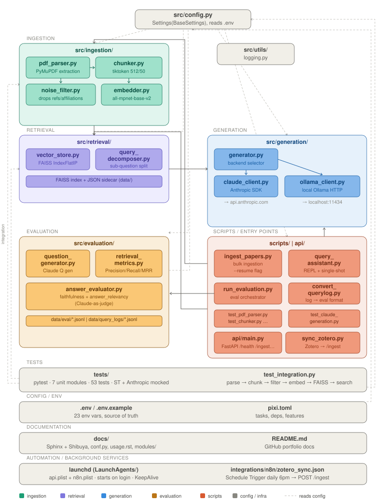

# Zotero RAG Assistant


A retrieval-augmented generation (RAG) system for querying a personal Zotero research library (~600 papers, mainly from psychology and neuroscience) using local embeddings and the Claude API. Built as a learning project to understand RAG architecture from the ground up — each component was implemented independently before any orchestration layer was introduced.

---

## What It Does

Ask a question in natural language → the system retrieves the most relevant passages from your PDF library → Claude answers using only that context, with numbered citations back to the source chunks.

```
$ pixi run query "What does the literature say about working memory and fluid intelligence?"

[streaming answer with chunk citations]
[claude-sonnet-4-6 · 412 tokens · $0.012345]
```

---

## Architecture



**Ingestion:** PDFs are parsed with PyMuPDF, split into 512-token sliding-window chunks (50-token overlap, tiktoken `cl100k_base`), filtered for noise (reference lists, affiliations, funding blocks — ~45% of chunks dropped), then embedded with `all-mpnet-base-v2` (768-dim, CPU-only batch inference).  
**Retrieval:** embeddings are stored in a FAISS `IndexFlatIP` index with L2-normalised cosine similarity; an optional query decomposer splits complex queries into sub-questions via Claude before merging and deduplicating results.  
**Generation:** a backend selector routes to either the Anthropic API (`claude_client.py`, cost tracked per query) or a local Ollama instance (`ollama_client.py`).  
**Evaluation:** question generation from index chunks via Claude, retrieval metrics (Precision@K / Recall@K / MRR), and answer quality scoring (faithfulness + answer relevancy) via Claude-as-judge (`answer_evaluator.py`).

All layers are independently testable. The pipeline was built one component at a time, with each stage confirmed working before moving to the next.

---

## Key Design Decisions

**Token-based chunking over character-based** — tiktoken gives token-accurate splits that respect LLM context limits. Chunk size (512) and overlap (50) are environment-configurable, not hardcoded.

**Noise filtering as a separate module** — reference lists, author affiliations, and funding acknowledgments degrade retrieval quality without contributing semantic signal. Filtering post-chunking but pre-embedding keeps the parser and chunker concerns clean. Confirmed ~45% chunk drop rate on a test paper, with all drops verified as legitimate noise.

**`all-mpnet-base-v2` over MiniLM variants** — higher quality embeddings at the cost of slightly slower inference; acceptable tradeoff for a CPU-only setup querying a static library.

**FAISS `IndexFlatIP` over IVF clustering** — exact cosine similarity is fast enough at ~30K vectors (600 papers × ~50 chunks). IVF approximate search would add complexity with no meaningful latency benefit at this scale.

**Local embeddings only** — zero embedding cost. The only API spend is at query time (Claude generation), which is tracked per-query and per-session.

**`all-mpnet-base-v2` already produces unit-norm vectors** — `faiss.normalize_L2()` is called at both write and query time anyway as a safety net, since cosine similarity via inner product requires unit vectors.

---

## What's Built

| Component | File | Status |
|---|---|---|
| PDF parser | `src/ingestion/pdf_parser.py` | ✅ complete |
| Text chunker | `src/ingestion/chunker.py` | ✅ complete |
| Noise filter | `src/ingestion/noise_filter.py` | ✅ complete |
| Embedder | `src/ingestion/embedder.py` | ✅ complete |
| FAISS vector store | `src/retrieval/vector_store.py` | ✅ complete |
| Query decomposer | `src/retrieval/query_decomposer.py` | ✅ complete (off by default) |
| Claude generation layer | `src/generation/claude_client.py` | ✅ complete |
| Ollama generation layer | `src/generation/ollama_client.py` | ✅ complete |
| Backend selector | `src/generation/generator.py` | ✅ complete |
| Centralised config | `src/config.py` | ✅ complete |
| Query CLI | `scripts/query_assistant.py` | ✅ complete |
| Bulk ingestion script | `scripts/ingest_papers.py` | ✅ complete |
| Evaluation module | `src/evaluation/` | ✅ complete |
| Pytest test suite | `tests/` | ✅ complete |
| FastAPI HTTP server | `api/main.py` | ✅ complete |
| Zotero sync script | `scripts/sync_zotero.py` | ✅ complete |
| n8n automation workflow | `integrations/n8n/zotero_sync.json` | ✅ complete |
| CI test workflow | `.github/workflows/tests.yml` | ✅ complete |

---

## Setup

### Prerequisites
- [pixi](https://prefix.dev/) for environment management
- Anthropic API key
- A directory of PDFs (Zotero export or otherwise)

### Install
```bash
cp .env.example .env
# edit .env with your API key and PDF path
pixi install
```

### Start the HTTP API server

```bash
pixi run api
```

Starts a FastAPI server at `http://localhost:8000` with five endpoints:
- `GET /health` — liveness check
- `POST /ingest` — fires off `ingest_papers.py --resume` as a background subprocess (returns immediately)
- `POST /sync` — runs `sync_zotero.py` (copies new PDFs from Zotero, then triggers `/ingest`); used by the n8n workflow
- `POST /reload` — re-reads the on-disk FAISS index into memory; called automatically after a background ingest so new papers become queryable without restarting the server
- `POST /query` — embeds the query, retrieves chunks, generates an answer; body: `{"query": "...", "top_k": 5}`

**Prerequisites:** A populated FAISS index in `DATA_DIR`.

> The API server and n8n start automatically on login via launchd — see [Background Services](#background-services) below.

### Sync new PDFs from Zotero

```bash
pixi run sync-zotero
```

Reads Zotero's local SQLite database (read-only), finds new PDFs in the `Psy/Neuroscience/AI` collection that aren't yet in `PDF_LIBRARY_PATH`, copies them over, and triggers `/ingest` via HTTP if any were added.

**Prerequisites:** `PDF_LIBRARY_PATH` set in `.env`; the API server (`pixi run api`) must be running for ingest to be triggered automatically.

### Ingest the full library
```bash
# Full run
pixi run ingest-library

# Resume an interrupted run (skips already-indexed papers)
pixi run ingest-library --resume
```
> Note: `OMP_NUM_THREADS=1` is set automatically inside the script to prevent a PyTorch 2.2.x OpenMP threading bug on Intel Mac.

### Query
```bash
# Single question (Claude)
pixi run query "your question here"

# Interactive REPL (Claude)
pixi run query

# Use the local Ollama backend instead
# (requires `ollama serve` running as a background process in a separate terminal)
pixi run query-ollama "your question here"
pixi run query-ollama

# Enable query decomposition (splits complex questions into sub-questions before retrieval)
# Off by default — see QUERY_DECOMPOSITION in .env
QUERY_DECOMPOSITION=true pixi run query "your question here"
QUERY_DECOMPOSITION=true pixi run query-ollama "your question here"

# Pass additional options directly (no `--` — pixi forwards args as-is)
pixi run query --top-k 8 --max-tokens 600 --verbose "your question"
```

---

## Configuration

```bash
# .env
ANTHROPIC_API_KEY=your-key-here
CLAUDE_MODEL=claude-sonnet-4-6
GENERATION_BACKEND=claude        # or 'ollama' for local inference
OLLAMA_MODEL=phi4-mini           # only used when GENERATION_BACKEND=ollama
PDF_LIBRARY_PATH=/path/to/zotero/folder
CHUNK_SIZE=512
CHUNK_OVERLAP=50
TOP_K_CHUNKS=5
MAX_TOKENS_PER_RESPONSE=500
USE_LOCAL_EMBEDDINGS=true
QUERY_DECOMPOSITION=false        # set true to split complex queries into sub-questions
QUERY_DECOMPOSITION_MODEL=claude-haiku-4-5-20251001
```

---

## Cost

| Operation | Cost |
|---|---|
| Embedding (full library) | ~$0 — local CPU only |
| Query (Claude Sonnet) | ~$0.01–0.02 per question |
| GPU | $0 — not required for inference |

---

## Testing

A pytest suite covers all core modules. 57 tests, all passing and manually verified.

```bash
# Unit tests only (excludes integration test)
pixi run test

# All tests including full pipeline integration test
pixi run test-all

# Unit tests with coverage report
pixi run test-cov
```

**Coverage:**

| Test file | What it covers |
|---|---|
| `test_pdf_parser.py` | Text extraction, metadata keys, page count, encrypted PDF handling |
| `test_chunker.py` | Chunk count, token overlap, metadata propagation, empty input |
| `test_noise_filter.py` | Reference lists, body text pass-through, funding blocks, affiliations |
| `test_embedder.py` | Output shape/dtype, empty-input raises, `embed_chunks` helper (ST mocked) |
| `test_vector_store.py` | Add/search correctness, top-k, score ordering, save/load round-trip, dimension mismatch |
| `test_config.py` | Env-var override, field types, `ValidationError` on invalid input |
| `test_query_decomposer.py` | Valid JSON parsing, malformed/empty fallback to original query (Anthropic mocked) |
| `test_query_pipeline.py` | Decomposition retrieval budget: full `top_k` per sub-question, dedup keeps max score, descending sort |
| `test_integration.py` | Full parse → chunk → filter → embed → FAISS → search round-trip (`@pytest.mark.integration`) |

> The integration test uses a deterministic mock embedder so no real model is loaded.
> `OMP_NUM_THREADS=1` is set in `conftest.py` to prevent the PyTorch OpenMP bug on Intel Mac.

### Continuous integration

`.github/workflows/tests.yml` runs both suites on GitHub Actions — `unit` (`pixi run test`) and `integration` (`pixi run test-all`) as parallel `ubuntu-latest` jobs — on every pull request and on pushes to `main` that touch `src/**`, `tests/**`, or the pixi manifests. No secrets are configured: `sentence_transformers` and `anthropic.Anthropic` are mocked in the tests and every `Settings` field has a default, so the suite runs without an API key or a `.env` file.

---

## Background Services

The API server runs as a launchd user agent; n8n runs as a Docker Compose service. Both start on their own and come back after a crash.

### n8n workflow automation

An n8n workflow (`integrations/n8n/zotero_sync.json`) runs daily at 6pm and POSTs to `http://host.docker.internal:8000/sync`, triggering the full Zotero → PDF copy → re-index pipeline with no manual intervention. To view or edit the workflow, open the n8n editor at `http://localhost:5678`.

n8n is defined in `docker-compose.yml` (image pinned to `n8nio/n8n:2.8.4`, bind-mounting the real `~/.n8n`):

```bash
docker compose up -d      # start
docker compose ps         # status
docker compose logs -f n8n
docker compose down       # stop
```

`restart: unless-stopped` brings the container back after a crash and when Docker Desktop starts — but **Docker Desktop itself must be set to open at login**, or the 6pm trigger never fires.

Two things that trip people up:

- **`host.docker.internal`, not `127.0.0.1`.** A container has its own loopback, so `127.0.0.1` from inside n8n means the container, not the Mac. This is also why the `api` pixi task binds `0.0.0.0` (see [Known Limitations](#known-limitations)).
- **The repo file is an export, not the live workflow.** What executes lives in `~/.n8n/database.sqlite`. Editing `integrations/n8n/zotero_sync.json` does not change the running workflow, and vice versa. After editing in the editor, re-export with **⋯ → Download** and replace the repo copy. To load the repo copy into a fresh n8n: **Workflows → Import from file**.

### Managing the launchd service

| Service | plist | Disable | Re-enable |
|---|---|---|---|
| FastAPI server | `com.zotero-rag.api.plist` | `launchctl unload ~/Library/LaunchAgents/com.zotero-rag.api.plist` | `launchctl load ~/Library/LaunchAgents/com.zotero-rag.api.plist` |

To apply a change to the `api` pixi task, restart the service — `uvicorn --reload` watches Python files and will not pick up new command-line flags:

```bash
launchctl kickstart -k gui/$(id -u)/com.zotero-rag.api
```

Logs are written to `~/Library/Logs/`:
- `zotero-rag-api.stdout.log` / `zotero-rag-api.stderr.log`

n8n no longer has a plist — its logs come from `docker compose logs n8n`.

---

## Ideas for further improvements

- **Verify and expand test suite** — manual review of generated tests; add edge cases as gaps are found
- **Reranking** — cross-encoder reranking post-retrieval for higher precision (though for the current DB size, precision is good enough)
- **Matryoshka Embeddings** - Deferred for now; maybe worth considering if index grows to 100K+ vectors (currently ~30K vectors in FAISS index) and two-stage retrieval needs to be considered for better latency.
---

## Known Limitations

- HTML web snapshots in Zotero exports are silently skipped (PDF parser only)
- **The API listens on all interfaces with no authentication.** The `api` task binds `0.0.0.0` so the n8n container can reach it, which also makes it reachable from anything on the local network: `/query` spends Anthropic credits under the configured key, and `/sync` / `/ingest` pin this CPU-only machine. It is not internet-exposed (router NAT), and containerising the api removes the LAN listener entirely — see Known Issues / Tech Debt in `PROJECT_STATUS.md`.
- **A green n8n execution does not prove the sync ran.** `/sync` and `/ingest` start their work in a detached subprocess and return immediately, so n8n records success the moment the process is spawned — it never learns the outcome. This is deliberate (embedding takes ~18 minutes; waiting would time out the request), but it means the workflow cannot report failure. The output is at least kept now: `logs/sync.log`, `logs/ingestion.log`, and `logs/api_subprocess.log` for anything that dies before logging starts.
